# 1. Repository revision and investigation method

**Repository revision (HEAD used for all line references):** `8ac9016f475e38a1d65911dd5d515b73e586b3d8`
**Branch:** `main`

**Method.** Every claim below was produced by reading the actual source, starting from
the `argparse` parser of the driver script and following each `choices=` value to the
function/class/backend it dispatches to, then following nested dispatch to the numerical
kernel. Loops, branches, retries, fallbacks, convergence checks, deadlines and exit
conditions were recorded from the called functions, not inferred from flag names. Line
numbers are approximate but taken from the inspected revision above; every diagram block
carries `file / function / line-range`.

**Scope note (two different "pump solvers" in the tree).** There are two unrelated pump
harmonic-balance implementations in the repository:

| Entry point | Package | Status in this doc |
| --- | --- | --- |
| `scripts/run_gain_map.py` | `src/twpa_solver/*` (numpy/scipy) | **In scope — fully traced.** This is the production pump + signal/gain solver. |
| `scripts/run_pump_hb.py` | `twpa.*` (a separate JAX/`jax.numpy` distributed-HB package: `twpa.solvers.hb_solver`, `twpa.nonlinear.distributed_hb`) | **Out of scope.** Different code base, different math (distributed HB, kinetic-inductance `I*`, `LinearSolveMethod`/`CoarseningMethod` enums). It does not import `twpa_solver` and shares no solver code with the gain map. Flagged here only so a reader does not confuse the two. |

Everything in §2–§15 refers to the `twpa_solver` path driven by `run_gain_map.py`
(plus the two diagnostic drivers `resume_column_force_gain.py` and the `--fold-follow`
mode), which is what the task asked for ("should all be in ./src/twpa_solver/").

---

# 2. CLI entry points

| Script | Role | Parser | Main |
| --- | --- | --- | --- |
| `scripts/run_gain_map.py` | Pump+gain map orchestrator (the primary CLI) | `parse_args()` L2111–2451 | `main()` L2745–2897 |
| `scripts/resume_column_force_gain.py` | Diagnostic: march one column past the fold, force gain on non-converged pumps | `main()` L173+ (wraps `run_gain_map.parse_args`) | `main()` L173–214 |
| `scripts/run_gain_map.py --fold-follow` | Diagnostic: trace the fold power vs frequency, write `fold_curve.csv`, no gain map | `run_fold_follow()` L1680–1714 | dispatched from `main()` L2786–2791 |

`resume_column_force_gain.py` reuses the **same** `run_gain_map.parse_args` plus a small
pre-parser (`--column-freq-ghz`, `--force-out`, `--force-max-nonfinite`), builds an
`InProcessEngine`, and calls `engine.solve_point(..., force_gain=True)`. Every engine/grid
flag from §12 applies to it unchanged.

There is **no** standalone `run_gain_map`-internal signal-only CLI; the gain solve is only
reachable through the map driver (in-process engine `InProcessEngine._gain`) or through the
legacy subprocess path (`experiments/exp09_full_ipm_gain_from_pump.py`, invoked by
`run_point`). The legacy `experiments/exp08_*`/`exp09_*` scripts are addressed only where
the subprocess executor calls them.

---

# 3. Shared architecture

Both solves consume the same **circuit model** and the same **pump-mode basis**, then
diverge:

- **Circuit model:** `CircuitMatrices` (`core/circuit.py` L14, loaded by `load_circuit`
  L103). Sparse `C, G, K` (node dynamical matrices), `Bphi` (node→branch incidence),
  `Ic`, `phi0`, `port_to_index`. Equation convention
  `C x'' + G x' + K x + Bphi i_J(Bphiᵀ x) = i_src`.
- **Pump-mode basis:** `resolve_pump_basis` (`pump/basis.py` L195) turns
  `--pump-mode-policy / --pump-mode-count / --harmonics` + design metadata into a concrete
  positive-integer mode list. Both the pump solve and the gain solve consume it (the gain
  solve reloads it from the saved `pump_solution.npz` via `load_pump_basis_from_solution`
  L246).
- **Divergence point:** the pump solve produces `pump_solution.npz` (harmonic phasors
  `X`); the gain solve reads that file back, builds `gamma(t)=cos(psi_p/phi0)·Ic/phi0`,
  and solves a **linear** Floquet/sideband system. The two are always coupled through the
  written `pump_solution.npz`, even in the in-process engine (numerics kept byte-identical
  to the subprocess path).

**Governing equation.** The circuit is a network of node fluxes $x(t)$ driven through the
branch incidence $B_\phi$ by the Josephson current $i_J$:

$$
C\,\ddot{x}(t) + G\,\dot{x}(t) + K\,x(t) + B_\phi\, i_J\!\big(B_\phi^{\top} x(t)\big) = i_{\mathrm{src}}(t),
\qquad i_J(\varphi) = I_c \sin(\varphi/\phi_0).
$$

The **pump solve** finds the steady periodic $x(t)$ at drive frequency $\omega_p$; the
**gain solve** linearizes $i_J$ about that pump, producing the time-periodic parametric
coupling $\gamma(t)=\cos\!\big(\psi_p(t)/\phi_0\big)\,I_c/\phi_0$ that mixes the signal
sidebands. Everything downstream is one of these two problems.

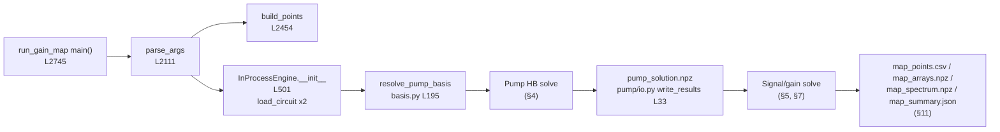

---

# 4. Pump solver

## 4.1 Top-level pump execution flow

```
CLI (run_gain_map)                       src file / function / lines
  parse_args                             run_gain_map.py parse_args 2111-2451
  → build_points (dBm→peak current)      run_gain_map.py build_points 2454; dbm_to_peak_current_a 76
  → executor dispatch                    run_gain_map.py main 2774-2830
      inprocess → InProcessEngine        run_gain_map.py InProcessEngine 490
      subprocess → run_point→EXP08       run_gain_map.py run_point 298 (experiments/exp08_*)
  → traversal dispatch                   run_gain_map.py main 2818-2824
      column      → run_warm_pass_inprocess   1195
      non-column  → run_map_traversal         1717
  → per cell: engine.solve_point         run_gain_map.py solve_point 606
      build problem                      _build_problem 546 → FullIPMPumpProblem (problem.py 89)
      Schur reduce (optional)            _make_solve_problem 561 → build_schur_problem (schur_operators.py 300)
      solve                              HarmonicNewtonKrylovSolver (solver.py 127)
      write pump                         summarize_solution/write_results (pump/io.py 13/33)
  → gain solve (if converged/force)      _gain 980 (§7)
  → status/gate/serialize               evaluate_gate 1835; write_* 1904-2109; main 2842-2893
```

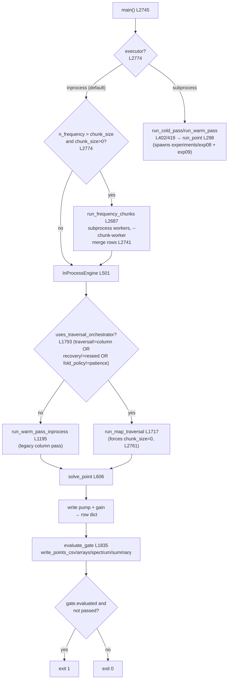

## 4.2 Pump problem assembly

`InProcessEngine._build_problem` (L546) constructs a `FullIPMPumpProblem`
(alias of `FullPumpProblem`, `problem.py` L89, alias L423). Key state:

- **Unknown representation:** complex array `X` of shape `(H, n)` = (`n_modes`, `n_nodes`),
  `problem.zeros()` (L145). Packed to real via `pack_complex` (`[Re…; Im…]`, L67) for GMRES.
- **Per-mode linear blocks** `D_k = K - (kω)²C + i(kω)G`, built once
  (`_build_linear_blocks` L132) as complex CSC.
- **Source** `source_coeffs(λ)` (L148): only row `source_row` (the fundamental mode),
  node `pump_node_index`, value `0.5·λ·pump_current_a`. `λ` (`source_scale`) is the natural
  continuation parameter (linear in the source).
- **Residual** `residual_coeffs(X, λ)` (L177): `D_k X_k + N_k(X) − S_k`, where
  `N` is the projected Josephson current (`nonlinear_current_coeffs` L174 via time-domain
  synth `grid.synthesize` `2·Re(E·X)`, L41).
- **JVP** (matrix-free tangent apply) `jvp_coeffs_with_tangent` (L195): analytic AFT
  Jacobian-vector product `D_k V_k + AFT[γ(t)·(Bphiᵀ v(t))]`. **Not** finite-difference, not
  autodiff (`backends/jvp_backends.py` documents this; `fd_jvp` exists only for tests).

**What the solver actually assembles.** In the harmonic (frequency-domain) basis the pump
residual for mode $k$, the per-mode linear operator, and the matrix-free tangent apply are

$$
R_k(X,\lambda) = D_k X_k + N_k(X) - S_k(\lambda),
\qquad
D_k = K - (k\omega_p)^2 C + i\,(k\omega_p)\,G,
$$

$$
S_k(\lambda) = \tfrac{1}{2}\,\lambda\, I_{\mathrm{pump}}\,\delta_{k,1}\ \text{at the pump node},
\qquad
N_k(X) = \mathcal{F}_k\!\Big[B_\phi\, I_c \sin\!\big(B_\phi^{\top} x(t)/\phi_0\big)\Big],
$$

where $x(t)=2\,\mathrm{Re}\sum_{k} X_k e^{ik\omega_p t}$ is the real waveform in the JC
positive-phasor convention and $\mathcal{F}_k$ is the alias-free Fourier projection onto
mode $k$. Rather than form the Jacobian $J=\partial R/\partial X$, the solver applies it to a
vector $V$ directly (this is what GMRES needs):

$$
\big(J\,V\big)_k = D_k V_k + \mathcal{F}_k\!\Big[\gamma(t)\,\big(B_\phi^{\top} v(t)\big)\Big],
\qquad \gamma(t)=\cos\!\big(\psi_p(t)/\phi_0\big)\,\tfrac{I_c}{\phi_0},
$$

i.e. the linear block plus the parametric coupling $\gamma(t)$ evaluated at the current
pump iterate. This same $\gamma(t)$ is what the signal solve later reuses (§9).

## 4.3 Pump backend dispatch (`--inproc-pump-backend`)

Two accepted values (`parse_args` L2225):

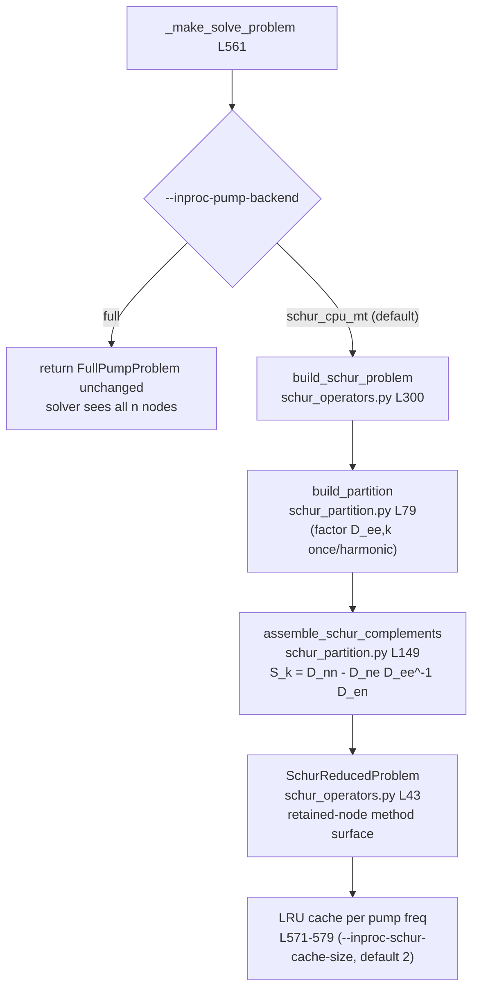

| Aspect | `full` | `schur_cpu_mt` (default) |
| --- | --- | --- |
| Unknown | complex `(H, n)` all nodes | complex `(H, m)` retained nodes (`SchurReducedProblem.zeros` L103) |
| Residual | `FullPumpProblem.residual_coeffs` L177 | `SchurReducedProblem.residual_coeffs` L124 (uses `S_k` apply, retained `Bphi_r`) |
| Linear apply | dense per-block `D_k` matvec | `S_k` assembled matvec (`_lin_apply` L96, mode `assembled`) or matrix-free `reduced_linear_apply` (`schur_partition.py` L203) |
| JVP | `jvp_coeffs_with_tangent` L195 | `jvp_coeffs_with_tangent` L138 (retained) |
| Post-solve | `X` is full already | `reconstruct_full` (`back_substitute_full` L217) once after convergence for exp09 |
| Factorization reuse | none of `D_ee` | `D_ee,k` factored once per frequency (constant in X), reused every Newton/Krylov iter |
| Device | CPU (scipy SuperLU / MKL PARDISO) | CPU (same) |

`build_schur_problem` retains **Josephson-incident nodes plus requested ports**
(`engine.ports`, L510; `build_partition` L106). The `linear_apply_mode` and harmonic-band
cutoffs (`precond_ell_diff_max/sum_max`) are constructor knobs of `SchurReducedProblem`
(schur_operators.py L60–68) but are **not exposed on the CLI** — always defaults
(`assembled`, no banding). Cache is an insertion-ordered dict acting as an LRU
(`_schur_part_cache` L517, evict-oldest L577).

**The reduction.** Per harmonic the nodes are split into *retained* $n$ (Josephson-incident
nodes plus requested ports) and *eliminated* $e$. Factoring the constant block $D_{ee,k}$
once per pump frequency yields the Schur complement and the reduced residual solved on the
retained nodes only:

$$
S_k = D_{nn,k} - D_{ne,k}\,D_{ee,k}^{-1} D_{en,k},
\qquad
R^{\mathrm{red}}_k = S_k\,X_k^{(n)} + N_k^{(n)}(X) - S^{\mathrm{src}}_k .
$$

The eliminated part is recovered by one back-substitution
$x_e = D_{ee}^{-1}\!\big(s_e - D_{en}\,x_n\big)$ after convergence (for the exp09 hand-off).
Because $D_{ee,k}$ does not depend on $X$, its factorization is reused across every Newton
and Krylov iteration — the main reason the Schur backend is the default.

**Warm-start / cold-start selection** happens in `solve_point` (L640):

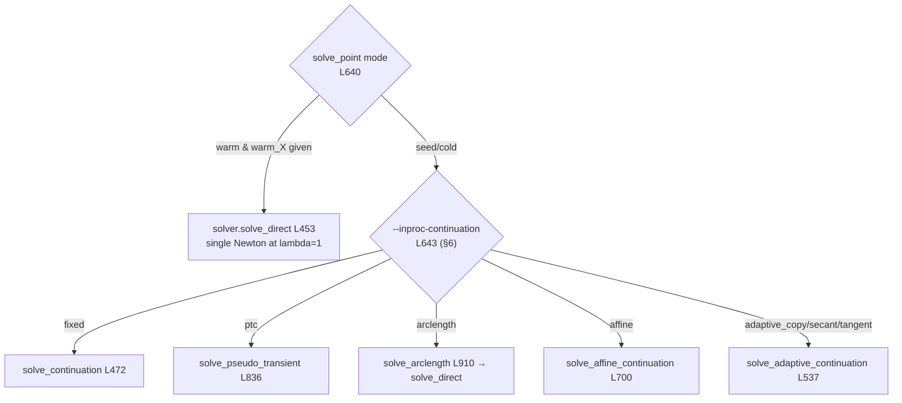

## 4.4 Convergence acceptance and status

`converged` is set in `solve_point` L724 as
`reports[-1].converged and |source_scale − 1.0| < 1e-12` — i.e. the last solve must have
converged **at full drive λ=1**. A converged-at-λ<1 continuation that stalls short of full
drive is **not** counted as converged. Row `pump_status` becomes `VALID_CONVERGED` else
`FAIL` (L748).

---

# 5. Signal solver

## 5.1 Signal backend dispatch (`--signal-backend`, `--signal-solver`)

`InProcessEngine._solve_signal` (L1059) selects the linear backend; `solve_linear_system`
(`floquet.py` L199) selects the sparse solver.

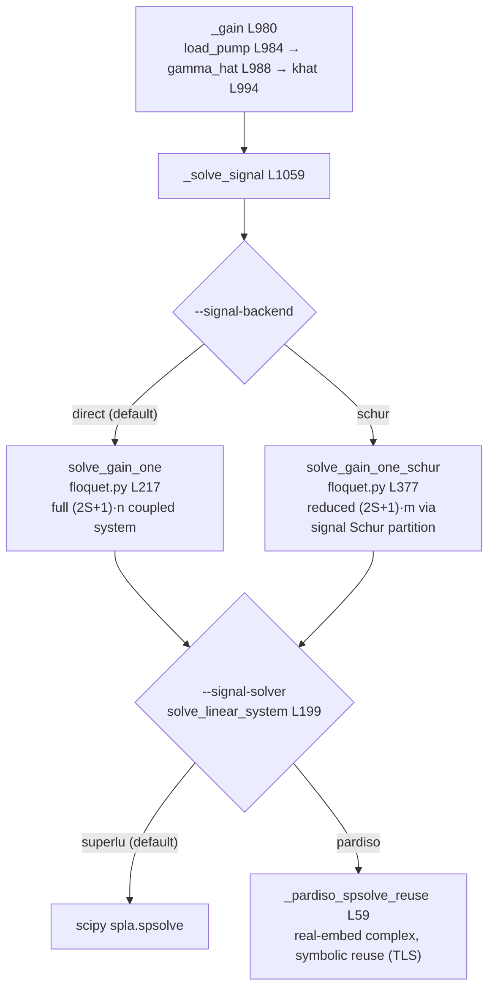

| Aspect | `direct` (`solve_gain_one` L217) | `schur` (`solve_gain_one_schur` L377) |
| --- | --- | --- |
| Sideband set | `sideband_list(S)` = `[-S..S]`, `2S+1` blocks (L84) | same |
| Sideband ordering/index | block `m` at rows `ms.index(m)·n`; RHS at `signal_m=0` (L149/L1084) | same but block stride `m_red` (retained) |
| System assembly | `assemble_conversion_matrix[_from_base]` L115/L103: block(m,q)=`khat[m−q]` + `D(ω_s+mω_p)` on diag | reduced blocks `khat_n[m−q]` + `part.schur[m]` (L414) |
| Formulation | full node system, **complex** | Schur-reduced retained system, complex; `build_signal_schur_partition` L359 |
| Solve | direct sparse factor-solve (`solve_linear_system`) | same, smaller matrix |
| Factor reuse | none across signal freqs (each `A` differs); `khat_big_base` reused across spectrum points (L1010) | signal Schur **partition** cached per (ω_p, ω_s, S, ports) key (L1063–1080), `--inproc-schur-cache-size` bound |
| Baselines | always: off (`khat_off_0`) + pump-diagonal (`khat[0]`) via `solve_single_block_transfer` L176 | optional — skipped if `--skip-baselines` (L447), `gain_db` still valid |
| Gain extraction | `vout_on = iω_s·φ_out`; S-param `port_s_from_unit_current_response` L69; `gain_db = 20·log10|S|` (`gain_db_from_s` L16) | same, retained positions `part.retained_pos` |
| Failure / nonfinite | `status="CHECK"` if `¬isfinite(gain)` or `linear_rel_residual > 1e-7` (L318) | `status="CHECK"` if `¬isfinite(|S|)` or resid>1e-7 (L487) |

`gain_status` becomes `VALID_SOLVED` only when `GainResult.status == "VALID_SOLVED"`
(solve_point L797). Any `CHECK` (nonfinite or high residual) leaves the row `gain_db`
populated but the cell status `ERROR` (solve_point L805).

## 5.2 Signal frequency construction

- Trailing (map) signal: `signal_ghz_for` (L109) = `--signal-ghz` if set, else
  `pump_ghz − --signal-detuning-mhz/1000` (tracks pump).
- Spectrum ladder (`--signal-spectrum`, default on): `spectrum_offsets_mhz` (L121) builds
  ±offsets `start, start+step, …` (`--signal-offset-*`), solved in `_gain` L1016–1039.

## 5.3 Parallel workers

`--signal-workers` (default 6) → a `ThreadPoolExecutor` over spectrum signal points
(`_gain` L1025–1027). Threads share the read-only `khat`, `khat_off_0`, `khat_big_base`.
PARDISO calls are guarded per-thread (`_PARDISO_TLS` L46, `_pardiso_thread_context` L26
limiting BLAS threads via `TWPA_PARDISO_THREADS`). `1` = serial.

---

# 6. Continuation controller

Two distinct continuation layers exist:

- **Intra-cell** (in pump amplitude λ, one cell): `--inproc-continuation` → `solver.py`.
- **Inter-cell** (across pump power and, in traversal mode, frequency): the warm-pass /
  traversal orchestration in `run_gain_map.py`, plus the recovery ladders.

## 6.1 Intra-cell (`--inproc-continuation`, 7 values)

Dispatched in `solve_point` L643–720. Every value is implemented (none unsupported).

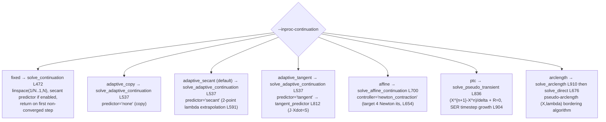

Adaptive step controller (`solve_adaptive_continuation` L537):

- Seed `X` = `x_init` or zeros; `λ=0`, `step=--adaptive-initial-step` (default 1.0).
- Predictor per value; a **predictor guard** (L601–623) rejects any predicted guess whose
  residual is `>max(100·copy_residual, 1e6)` or non-finite → falls back to copy.
- On converge: `λ←target`, `step←min(1, max(min_step, step·growth))` with `growth=1.5`
  (or the affine `newton_contraction` rule L654–659). Loop until `λ ≥ 1−1e-12`.
- On fail: `step←step·shrink` (`shrink=0.5`); if `step<min_step` (`--adaptive-min-step`
  default 0.05) → **fixed fallback** `solve_continuation(fallback_fixed_steps)`
  (`--inproc-fallback-fixed-steps` default 20) L682, `trace.fallback_used=True`.
- **Deadline:** `max_wall_s` = `--inproc-continuation-deadline-s` if >0 else
  `--inproc-solve-deadline-s` (solve_point L686–690). Checked at loop top (L573) and before
  fallback (L670).

Fixed (`solve_continuation` L472): `λ` over `linspace(1/N, 1, N)` (`--continuation-steps`
default 20), optional secant predictor (L496), returns immediately on the first
non-converged `λ` (L527).

**The math of a predictor step.** All intra-cell methods drive the drive parameter
$\lambda:0\to1$ solving $R(X,\lambda)=0$, differing only in how they predict the next
Newton guess. With $S=\partial R/\partial\lambda$ the source sensitivity:

$$
\text{secant:}\quad X^{\mathrm{p}} = X_j + \frac{\lambda^\star-\lambda_j}{\lambda_j-\lambda_{j-1}}\,(X_j - X_{j-1}),
\qquad
\text{tangent:}\quad J\,\dot X = S,\ \ X^{\mathrm{p}} = X_j + \Delta\lambda\,\dot X .
$$

Pseudo-transient continuation (PTC) instead damps toward the root with a pseudo-timestep
$\delta$ grown by the switched-evolution-relaxation (SER) rule:

$$
\frac{X^{n+1}-X^{n}}{\delta} + R(X^{n+1}) = 0,
\qquad
\delta \leftarrow \delta\,\frac{\lVert R^{n-1}\rVert}{\lVert R^{n}\rVert}.
$$

Pseudo-arclength replaces $\lambda$ by arclength $s$ as the marching variable and appends a
tangent-plane constraint, which lets it round a **fold** (turning point) where $\dot\lambda$
changes sign — a place natural-parameter continuation cannot pass:

$$
R(X,\lambda)=0,\qquad
\dot X^{\top}(X-X_0) + \dot\lambda\,(\lambda-\lambda_0) - \Delta s = 0 .
$$

PTC (`solve_pseudo_transient` L836): modified-Newton with shift `1/δ` via `_solve_linear`
(shift arg L881); damped acceptance on true residual (L892); SER growth
`δ←max(δ, δ·prev/curr)` (L904); `max_it = 4·max_newton`; deadline honored (L861, L884).

Pseudo-arclength (`solve_arclength` L910): joint `(X, λ)`, tangent-plane constraint;
bordering algorithm — one predictor-point factorization reused across corrector iterations
(`_linear_solver` L736), two solves `J a=−R`, `J b=S` per corrector (L973/L981); fold
detected as sign change of `λ_dot` (L1010); target crossing interpolated (L1013). Returns
`(X, λ, info)` with `reached_target`, `fold_lambda`, `terminal_reason` ∈
`{target, deadline, minimum_step, max_steps}`.

## 6.2 Inter-cell continuation (power axis — legacy column pass)

`run_warm_pass_inprocess` (L1195): per frequency column, ascending power. Each cell warm-
starts from the previous converged pump `X` via `solve_direct` (single full-scale Newton).
Predictor `--inproc-fold-predictor` (`none`|`secant`, default `secant`) builds the guess by
`secant_guess` (L1111) extrapolating along the pump-current axis from the last two
converged states.

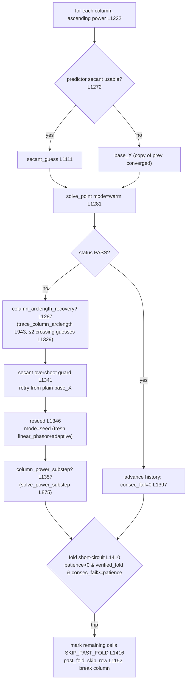

- `--inproc-fail-fast` (L1197/1263): skip reseed/substep recovery, keep warm-starting from
  the last **converged** neighbour (`base_X = last_good_X`). One stalled solve per over-fold
  cell instead of the full recovery chain.
- `--initial-pump-dir` / `--initial-pump-power-dbm` (L1217–1260): seed each column's first
  cell from a saved verified pump solution (single frequency column only, else `ValueError`
  L1218).

### Power substep (`--column-power-substep`)

`solve_power_substep` (L875): adaptive natural-parameter continuation **along the map power
axis** from the last converged state to the failed target current. Step in dBm (geometric in
current `I·10^(dB/20)`), init `--column-power-substep-init-db` (0.1), grow ×1.5 / halve on
fail. If step must drop below `--column-power-substep-min-db` (0.005) → `step_floor`
terminal reason → returns `None`, sets `verified_fold=True` and records
`pump_power_substep_stall_dbm` (L1379–1383). Bounded by
`--column-power-substep-deadline-s` (120 s). A recovered `X` re-runs `solve_point` (L1374)
so gain + files come from the normal path.

### Column arclength recovery (`--column-arclength-recovery`)

`trace_column_arclength` (L943) → `trace_arclength_from_two_points` (`solver.py` L1022):
traces one scaled pseudo-arclength branch from the last two converged states, interpolates
target-current crossings, uses up to 2 as Newton recovery guesses. `--column-arclength-ds`
(0.02), `--column-arclength-max-steps` (80), `--column-arclength-deadline-s` (180). Fresh on
every failing cell (no per-column lock). A detected `fold_lambdas` sets `verified_fold`.

## 6.3 Inter-cell continuation (2-D traversal orchestrator)

`run_map_traversal` (L1717) — one shared `solved[(i,j)]→X` store across **both** axes; forced
single-process (`main` L2761 sets `--frequency-chunk-size 0`).

- `--traversal` (`_traversal_order` L1439): `column` (col-major), `backbone` (lowest-power
  freq row first, then columns upward; `--backbone-direction` ltr/rtl/center_out/two_ended
  L1451), `nearest` (col-major but recovery uses nearest solved), `serpentine` (alternating
  power direction/column), `floodfill` (Prim cheapest-neighbour from central low-power seed
  L1488).
- `--predictor` (`_build_candidates` L1525, `_select_guess` L1563): `copy`, `power_secant`,
  `freq_secant`, `corner`, `plane`, `portfolio` (residual-ranked via
  `predictors.rank_candidates` L149 using `engine.residual_norm` L593). `--portfolio-policy`
  best|ranked (ranked retries candidates in order L1753).
- `--recovery` (`_recover` L1595): `none`, `reseed` (fresh linear_phasor+adaptive),
  `alt_parent` (retry from power/freq/diagonal parents), `bridge` (`solve_bridge` L813,
  physical-parameter continuation), `ladder` (residual-rank parents then bridge).
- `--fold-policy` (`_recover` L1644): `patience` (count every fail), `cross_axis`,
  `bridge_gate`, `combined` (ladder of extra rescues before counting), `arclength` (round
  the fold with `solve_arclength` L1661).

`solve_bridge` (L813) modes: `diagonal`, `freq_first`, `power_first`, `adaptive` (halving
step on fail, L838); `--bridge-steps` (4), `--bridge-mode` (adaptive).

---

# 7. Newton–Krylov iteration

One corrector call = `HarmonicNewtonKrylovSolver.solve_one` (`solver.py` L131–451).

**One Newton iteration.** Each iteration linearizes the residual and solves for the update
$\Delta X$, then damps it with a backtracking line search:

$$
J(X^{(i)})\,\Delta X = -R(X^{(i)}),
\qquad
X^{(i+1)} = X^{(i)} + \alpha\,\Delta X,\quad \alpha = 2^{-j},
$$

with $J=\partial R/\partial X$ applied **matrix-free** (the JVP of §4.2 — no assembled
Jacobian). The linear system is solved by right-preconditioned GMRES,

$$
J\,M^{-1} y = -R,\qquad \Delta X = M^{-1} y ,
$$

so an approximate or stale preconditioner $M$ (§8) only changes the Krylov iteration count,
never the converged root. Convergence is the coefficient-relative residual
$\lVert R\rVert_{\mathrm{coeff}} < \mathtt{newton\_tol}$ (default $10^{-9}$); the line search
accepts $\alpha$ only if $\lVert R\rVert$ strictly decreases, and a stall detector fails the
cell if the reduction ratio stays above $0.8$ for $4$ consecutive steps.

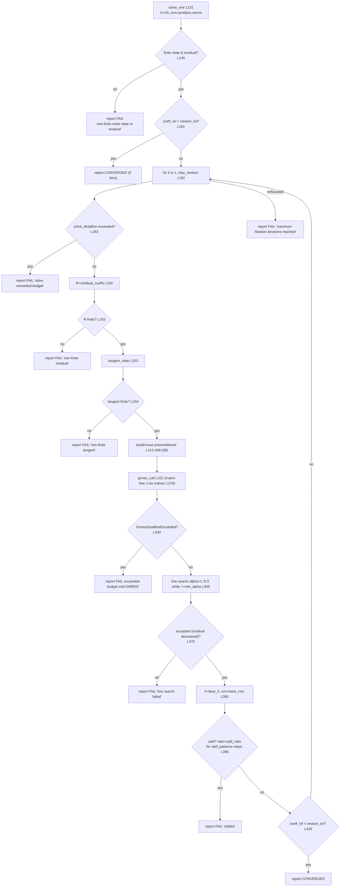

**Stopping conditions and their exact origins:**

| Condition | Where | `failure_reason` string |
| --- | --- | --- |
| Absolute/relative residual tol | L161, L425 (`coeff_rel < newton_tol`) | `""` (converged) |
| Coefficient-relative tol | same — `norms()["coeff_rel"]` (`problem.py` L293) | — |
| Max Newton iterations | L182 loop bound, L439 | `maximum Newton iterations reached` |
| Max GMRES iterations | passed to `gmres_call` (`gmres_restart=60`×`gmres_maxiter`); `info!=0` recorded but does **not** abort Newton (L349) | `GMRES did not fully converge, info=…` |
| GMRES deadline | `gmres_call` per-iteration callback L1194 raises `GmresDeadlineExceeded` | `solve exceeded …s budget mid-GMRES at Newton {it}` |
| Non-finite residual (initial / mid) | L146, L193 | `non-finite initial state or residual` / `…residual before linear solve` |
| Non-finite tangent | L204 | `non-finite tangent before linear solve` |
| Line-search exhaustion | L375 (`alpha < min_alpha=1/1024`) | `line search failed at Newton {it}` |
| Residual increase | handled inside line search (only accept a decrease, L367) | — |
| Step-size underflow | `min_alpha` bound L359 | (→ line-search failure) |
| Stall detector | L396–410 (`stall_ratio=0.8`, `stall_patience=4`) | `stalled at Newton {it} (reduction ratio …)` |
| Solve deadline (per Newton) | L183 | `solve exceeded {…}s budget at Newton {it}` |
| Backend exception (PARDISO strict) | propagates from `_factor`/`solve` (`fast_coupled.py` L346/L378) | RuntimeError (not a StepReport) |

There is **no external cancellation token**; the only timeout mechanism is
`solve_deadline_s` (per solve) + the continuation `max_wall_s`.

---

# 8. Preconditioners and sparse solvers

`--inproc-preconditioner` (5 values, L2218) selects the preconditioner built each Newton
step in `solve_one` L233–257. All are GMRES accelerators only — the Newton update is always
against the true matrix-free Jacobian (`matvec` L270), so a stale/approx preconditioner
never changes the converged root.

**What each preconditioner factorizes.** They differ in how much of the mode coupling they
keep. The cheap `mean_tangent` block is diagonal in harmonic index, using only the
time-average $\bar\gamma=\langle\gamma(t)\rangle_t$:

$$
M_k = D_k + B_\phi\,\mathrm{diag}(\bar\gamma)\,B_\phi^{\top}.
$$

The `real_coupled` / `real_coupled_fast` variants assemble the exact mode-coupled Jacobian,
where mode $k$ couples to mode $q$ through the convolution harmonic $\hat\gamma_{k-q}$ **and**
its conjugate partner $\hat\gamma_{k+q}$ (the term `spectral_coupled` drops for speed):

$$
J_{k,q} = D_k\,\delta_{k,q}
        + B_\phi\,\mathrm{diag}(\hat\gamma_{k-q})\,B_\phi^{\top}
        + B_\phi\,\mathrm{diag}(\hat\gamma_{k+q})\,B_\phi^{\top}\ (\text{conjugate}) .
$$

This is real-packed as $[\mathrm{Re};\mathrm{Im}]$ and LU-factored (PARDISO). Because it is the
exact reduced Jacobian, GMRES then needs $\sim\!1$ iteration; `real_coupled_fast` additionally
reuses the symbolic factorization (fixed sparsity) so only the numeric phase repeats.

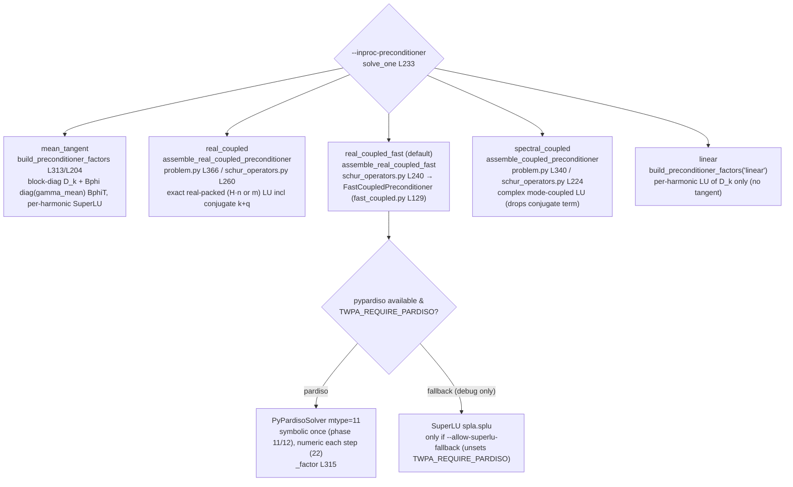

| CLI value | Matrix factorized | Symbolic reuse | Numeric refactor | GMRES convergence | Notes / restrictions |
| --- | --- | --- | --- | --- | --- |
| `mean_tangent` | `D_k + Bphiᵀ·diag(γ_mean)·Bphi` per harmonic (block-diag) | none (fresh `splu` each step) | every step | several iters | cheapest for tiny warm-start steps |
| `real_coupled` | exact real-packed `(2·H·n)` Jacobian incl. conjugate `K_{k+q}` (`_build_real_coupled_matrix` L372) | none | every step | ~1 iter | full backend only; costly LU |
| `real_coupled_fast` (default) | same exact matrix, but assembly via precomputed scatter map + **symbolic-factorization reuse** (`FastCoupledPreconditioner`) | **yes** (PARDISO phase 11 once/partition; scatter map cached on partition) | numeric phase 22 each step | ~1 iter | **Schur backend only** — raises `NotImplementedError` on `full` (`solve_one` L242) |
| `spectral_coupled` | complex mode-coupled `(H·n)` LU, drops conjugate `k+q` term (`assemble_coupled_preconditioner` L340) | none | every step | few iters | near-exact for weak conjugate coupling |
| `linear` | `D_k` only, per harmonic | none | once (X-independent) but rebuilt per step in loop | many iters | ignores nonlinearity |

**Reuse policy (`--inproc-precond-reuse`, `--inproc-precond-refresh-gmres`).** `solve_one`
L217–223 decides `refresh`: rebuild if no cache, `precond_reuse ≤ 1`, `steps_since_factor ≥
precond_reuse`, or previous GMRES iters `≥ refresh_gmres`. Reuse trades extra GMRES iters
for skipping the LU rebuild (modified-Newton). Default `precond_reuse=1` refactors every
step.

**Sparse factorization libraries:**

- **SuperLU** (`scipy.sparse.linalg.splu`): mean_tangent / spectral_coupled / real_coupled /
  linear factor with SuperLU; the Schur `D_ee` blocks (`schur_partition.py` L128) and signal
  `superlu` path (`floquet.py` L200).
- **MKL PARDISO** (`pypardiso`): `real_coupled_fast` (`fast_coupled.py` `_factor` L315) and
  the signal `pardiso` path (`_pardiso_spsolve_reuse` L59). Both single-thread the BLAS via
  `_pardiso_thread_context` (env `TWPA_PARDISO_THREADS`, default 1) to dodge a
  Windows MKL reordering failure (error −3).

**PARDISO strictness / telemetry.** `main` L2749–2755 sets `TWPA_REQUIRE_PARDISO=1` unless
`--allow-superlu-fallback`, and `TWPA_PARDISO_LOG=1` if `--log-factor-backend`. Under strict
mode a PARDISO failure **raises** (`fast_coupled.py` L346/L378) rather than silently
downgrading. Telemetry: `last_assembly_runtime_s`, `last_factor_runtime_s`,
`last_factor_backend` on the preconditioner, surfaced into the row as
`pump_preconditioner_assembly_runtime_s` / `…_numeric_factor_runtime_s` (solve_point
L756–757, sourced solver.py L266–268).

**Matrix-free advanced-continuation path.** `_linear_solver` (`solver.py` L736) always uses
the exact real-coupled factor (`assemble_real_coupled_fast` if Schur, else
`assemble_real_coupled_preconditioner`) regardless of `--inproc-preconditioner` — the
tangent/PTC/arclength solves are near-direct.

---

# 9. Signal-side factor solve (detailed)

**The linear Floquet problem.** The converged pump fixes
$\gamma(t)=\cos\!\big(\psi_p(t)/\phi_0\big)\,I_c/\phi_0$; its Fourier harmonics
$\hat\gamma_\ell$ build the parametric coupling matrices

$$
\hat K_\ell = B_\phi\,\mathrm{diag}(\hat\gamma_\ell)\,B_\phi^{\top}.
$$

A small signal at $\omega_s$ scatters into sidebands $m\in\{-S,\dots,S\}$ at
$\omega_s+m\omega_p$. These are coupled by the block **conversion matrix**, giving one linear
system per signal frequency (no nonlinear iteration):

$$
A_{m,q} = \hat K_{m-q} + \delta_{m,q}\,D\!\big(\omega_s + m\omega_p\big),
\qquad
A\,\Phi = b ,
$$

where $D(\omega)=K-\omega^2 C + i\omega G$ is the linear node admittance and the RHS $b$
injects a unit current at the source port in the signal sideband $m=0$. The output port
flux gives the wave and the scattering parameter, hence the gain in dB:

$$
v_{\mathrm{out}} = i\,\omega_s\,\phi_{\mathrm{out}},
\qquad
G_{\mathrm{dB}} = 20\,\log_{10}\big\lvert S_{\mathrm{out,src}}\big\rvert .
$$

The `schur` backend applies the same reduction as §4.3 to $A$ before solving; the two
baseline solves (pump off, pump-diagonal) reuse $\hat K$ at $\ell=0$ to normalize the gain.

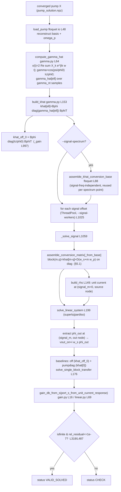

**Loops involved:**

- **Pump map cells:** `run_warm_pass_inprocess` / `run_map_traversal` iterate cells; each
  converged (or `force_gain`) cell calls `_gain` (solve_point L786).
- **Signal frequencies:** spectrum offsets `spectrum_offsets_mhz` (L121), looped in `_gain`
  L1016–1039; plus one trailing target signal (L1041).
- **Worker threads:** `ThreadPoolExecutor(--signal-workers)` over offsets (L1026).
- **Sidebands:** implicit in the `(2S+1)` block assembly (`sideband_list`, L84).
- **Ports:** fixed `source_port`/`out_port`; RHS built at the source, output read at the
  out node (`build_rhs` L149, `extract_sideband_node` L162).
- **Shared factorization:** `khat_big_base` (spectrum) and the signal Schur **partition**
  cache (per (ω_p, ω_s, S, ports), L1063) amortize assembly; there is **no** shared LU
  across signal frequencies (each `A(ω_s)` differs), unlike the pump `D_ee` reuse.

`load_pump` upcasts the float32-stored `X` back to complex128 (`load_pump_basis_from_solution`
L264) so float32 storage never leaks complex64 into scipy.

---

# 10. Fold detection and fold recovery

There is **no single fold flag**; "fold" is inferred through several paths and only the
`arclength`/substep paths *confirm* a turning point, versus a mere numerical failure.

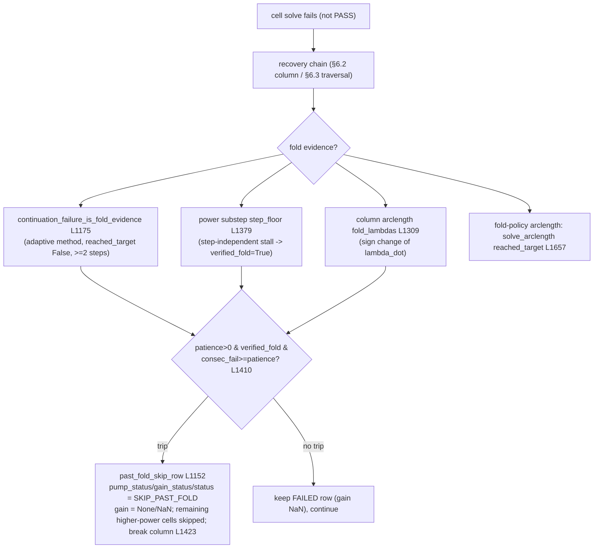

- **Predictor failure near fold:** secant overshoot guard retries from the plain warm start
  (`run_warm_pass_inprocess` L1341).
- **Newton failure near fold:** stall detector / deadline in `solve_one` fail the cell fast
  (§7), avoiding thousands of GMRES iters.
- **Retry from plain warm start / reseed:** L1342 / L1346.
- **Tangent/mean-tangent recovery:** via `--inproc-continuation adaptive_tangent`
  (tangent_predictor) or the mean_tangent preconditioner; no dedicated "tangent recovery"
  path beyond these.
- **Pseudo-arclength path:** `--column-arclength-recovery` (column) and `--fold-policy
  arclength` (traversal).
- **Fixed continuation fallback:** inside `solve_adaptive_continuation` when the step floor
  is hit (L682).
- **Fold-skip patience counter:** `--fold-skip-patience` (default 0 = disabled). In the
  legacy column pass the skip requires **both** `consec_fail ≥ patience` **and**
  `verified_fold` (L1410) — a bare failed solve is never treated as a fold. In
  `run_map_traversal` (L1785) the traversal short-circuit uses `col_fail[j] ≥ patience`
  **without** the `verified_fold` gate (a documented asymmetry, see §14).
- **`SKIP_PAST_FOLD`:** the string constant (L1133); rows via `past_fold_skip_row` (L1152).
  Gain is `None` in the row → `NaN` in the grid (`gain_grid` L1938).
- **False-fold risk:** a small `--inproc-max-newton` / short `--inproc-solve-deadline-s`
  makes a solvable-but-stiff cell fail; combined with traversal patience (no `verified_fold`
  gate) this can skip a real operating region. Documented in the memory
  `foldskip-culls-broadband-2c`.
- **Numerical failure vs confirmed fold:** only `verified_fold` (substep step_floor,
  arclength sign change) marks a confirmed turning point; everything else is a numerical
  failure (`FAIL`, gain NaN, retryable).
- **`--fold-follow`** (`run_fold_follow` L1680) is a separate diagnostic mode: at each
  frequency it builds the max-power problem and calls `fold_power` (`solver.py` L1225,
  pseudo-arclength from λ=0 until the first `λ_dot` sign change) → `fold_curve.csv`. No gain
  map is produced (`main` L2786–2791).

---

# 11. Status propagation (state machine)

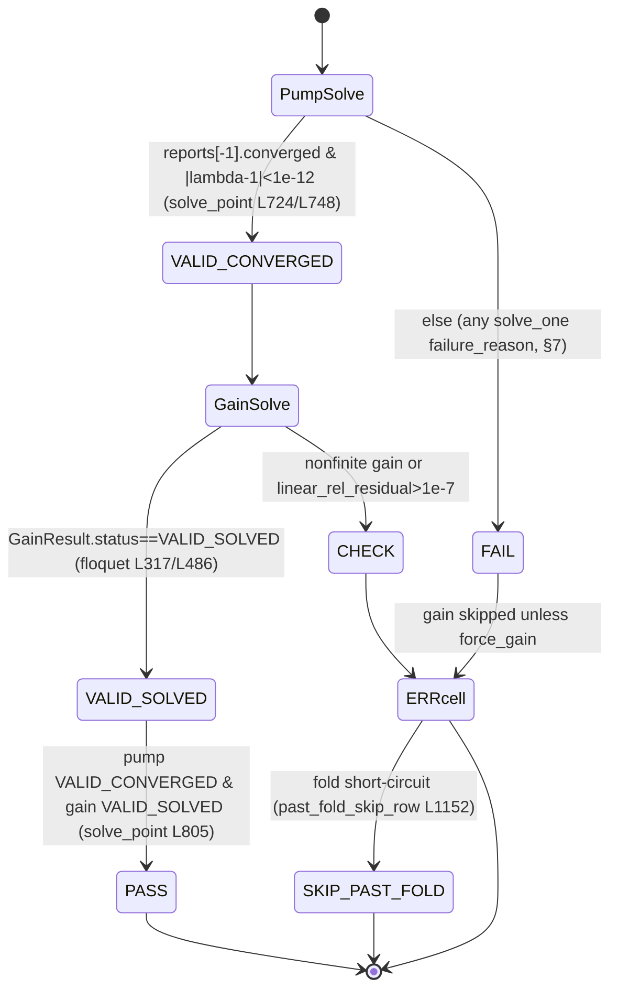

Exact status strings found in the implementation and their handling:

| Status | Created at | Condition | Retryable? | Triggers fallback? | Terminates | Gain computed? | Written | Exit code |
| --- | --- | --- | --- | --- | --- | --- | --- | --- |
| `VALID_CONVERGED` (pump) | solve_point L748; write_results L62 | converged at λ=1 | — | — | — | yes | `pump_status` col, `pump_report.json final_status` | — |
| `FAIL` (pump) | solve_point L748; write_results L64 | any `solve_one` non-converge | yes (recovery chain) | yes | cell | no (unless `force_gain`) | `pump_status`, `pump_failure_reason` | — |
| `VALID_SOLVED` (gain) | `GainResult` floquet L317/L486 | finite gain, resid≤1e-7 | — | — | — | yes | `gain_status`, `gain_db` | — |
| `CHECK` (gain) | floquet L318/L487 | nonfinite or resid>1e-7 | (not retried) | no | cell → `gain_status=ERROR` in row unless VALID_SOLVED | yes but suspect | `gain_status` (mapped to ERROR at L781/L798) | — |
| `PASS` (cell) | solve_point L805 | pump VALID_CONVERGED **and** gain VALID_SOLVED | — | — | — | yes | `status` col | — |
| `ERROR` (cell) | solve_point L781/L806 | anything else | (recovery already ran) | — | cell | maybe | `status` col | — |
| `SKIP_PAST_FOLD` | L1133 / `past_fold_skip_row` L1152 | patience trip past a verified fold | no (intentional) | no | remaining higher-power cells in column | no (NaN) | `status`/`pump_status`/`gain_status`, `pump_failure_reason` | — |
| GMRES/line-search/stall/deadline/nonfinite | `failure_reason` strings inside `StepReport` (§7) | see §7 table | — | — | rolls up into pump `FAIL` | — | `pump_failure_reason` col + `pump_report.json reports[]` | — |

**Note on naming.** The task's example enum names (`CONVERGED`, `SOLVED`, `GMRES_FAILED`,
`LINE_SEARCH_FAILED`, `MAX_NEWTON`, `DEADLINE`, `STALL`, `NONFINITE`, `UNSUPPORTED_BACKEND`,
`INVALID_CONFIGURATION`, `MISSING_SEED`, `PARTIAL`) are **not** literal strings in the code.
The implementation uses: pump `VALID_CONVERGED`/`FAIL`, gain `VALID_SOLVED`/`CHECK`, cell
`PASS`/`ERROR`/`SKIP_PAST_FOLD`, plus free-text `failure_reason` phrases (e.g. `stalled at
Newton …`, `line search failed at Newton …`, `maximum Newton iterations reached`, `solve
exceeded …s budget …`, `non-finite …`, `GMRES did not fully converge, info=…`). "Unsupported
backend" surfaces as a raised `NotImplementedError`/`ValueError`, never a status string.

**Process exit codes** (`main` L2891–2893): `1` iff a gate was evaluated and failed; else
`0`. A chunk worker failure raises `RuntimeError` (`run_frequency_chunks` L2740) →
non-zero via the unhandled exception. `--fold-follow` returns `0` (L2791). Per-cell FAIL
does **not** by itself set a non-zero exit.

---

# 12. CLI option inventory

`Scope` codes: **Pump**, **Signal**, **Cont** (continuation), **Precond**, **Sparse**,
**Trav** (map traversal), **Par** (parallelism), **Out**, **Recov**, **Res** (resource
limits), **Exec**.

All rows are from `run_gain_map.parse_args` (L2111–2451) unless noted. Full machine-readable
form: `cli_inventory.csv` / `cli_inventory.json`.

| CLI flag | Accepted values | Default | Scope | Dispatch location | Effect | Status |
| --- | --- | --- | --- | --- | --- | --- |
| `--mode` | cold, warmstart, both | warmstart | Exec | main L2827 | which passes run + gate | Production |
| `--executor` | subprocess, inprocess | inprocess | Exec | main L2815 | in-process engine vs exp08/exp09 subprocess | Production (subprocess legacy) |
| `--inproc-pump-backend` | full, schur_cpu_mt | schur_cpu_mt | Pump | `_make_solve_problem` L569 | full vs Schur-reduced | Production |
| `--inproc-preconditioner` | mean_tangent, real_coupled, real_coupled_fast, spectral_coupled, linear | real_coupled_fast | Precond | solve_one L233 | §8 | Production; `real_coupled_fast` Schur-only |
| `--inproc-continuation` | fixed, adaptive_copy, adaptive_secant, adaptive_tangent, affine, ptc, arclength | adaptive_secant | Cont | solve_point L643 | §6.1 | Production (arclength experimental) |
| `--inproc-schur-cache-size` | int | 2 | Res | L518, L1079 | LRU bound of Schur partitions | Production |
| `--inproc-precond-reuse` | int | 1 | Precond | solve_one L217 | modified-Newton factor reuse | Production |
| `--inproc-precond-refresh-gmres` | int | 0 | Precond | solve_one L221 | staleness refresh trigger | Production |
| `--inproc-fold-predictor` | none, secant | secant | Cont | warm pass L1214 | column secant predictor | Production |
| `--inproc-gmres-maxiter` | int | 80 | Res | `_settings` L537 | GMRES restart cycles | Production |
| `--inproc-solve-deadline-s` (`--inproc-solve-deadline`) | float | 0.0 | Res | `_settings` L541, solve_one L183 | per-solve wall budget (0=off) | Production |
| `--inproc-max-newton` | int | 16 | Res | `_settings` L536 | max Newton iters | Production |
| `--inproc-fallback-fixed-steps` | int | 20 | Cont | solve_point L697/L708 | fixed ladder after adaptive gives up | Production |
| `--inproc-continuation-deadline-s` | float | 0.0 | Res | solve_point L686 | adaptive/affine budget (0 inherits solve-deadline) | Production |
| `--inproc-fail-fast` | flag | off | Recov | warm pass L1197; `_recover` L1672 | skip recovery, chain from last converged | Production |
| `--initial-pump-dir` | path | None | Recov | warm pass L1217 | seed each column first cell | Production (single column only) |
| `--initial-pump-power-dbm` | float | None | Recov | warm pass L1239 | power coord of the seed | Production (required with above) |
| `--fold-skip-patience` | int | 0 | Recov | warm pass L1216, traversal L1734 | fold short-circuit patience (0=off) | Production |
| `--column-arclength-recovery` | flag | off | Recov | warm pass L1289 | per-cell arclength crossings as guesses | Experimental |
| `--column-arclength-ds` | float | 0.02 | Cont | L963 | arclength step | Experimental |
| `--column-arclength-max-steps` | int | 80 | Cont | L964 | arclength steps | Experimental |
| `--column-arclength-deadline-s` | float | 180.0 | Res | L965 | arclength trace budget | Experimental |
| `--column-power-substep` | flag | off | Recov | warm pass L1359 | adaptive power-axis micro-continuation | Production |
| `--column-power-substep-init-db` | float | 0.1 | Cont | L1367 | init/max dBm micro-step | Production |
| `--column-power-substep-min-db` | float | 0.005 | Cont | L1368 | stall floor (fold evidence) | Production |
| `--column-power-substep-deadline-s` | float | 120.0 | Res | L1369 | per-target budget | Production |
| `--traversal` | column, backbone, nearest, serpentine, floodfill | column | Trav | `_traversal_order` L1439; main L2761 | map order; non-column forces chunk_size 0 | Production (non-column experimental) |
| `--backbone-direction` | ltr, rtl, center_out, two_ended | center_out | Trav | `col_order` L1451 | backbone row order | Production |
| `--predictor` | copy, power_secant, freq_secant, corner, plane, portfolio | power_secant | Cont | `_select_guess` L1563 | inter-cell guess (traversal only) | Production |
| `--portfolio-policy` | best, ranked | best | Cont | traversal L1753 | portfolio retry policy | Production |
| `--recovery` | none, reseed, alt_parent, bridge, ladder | reseed | Recov | `_recover` L1620 | failed-cell recovery ladder | Production |
| `--bridge-steps` | int | 4 | Recov | `solve_bridge` L837 | bridge sub-steps | Production |
| `--bridge-mode` | diagonal, freq_first, power_first, adaptive | adaptive | Recov | `solve_bridge` L855 | bridge path | Production |
| `--fold-policy` | patience, cross_axis, bridge_gate, combined, arclength | patience | Recov | `_recover` L1644 | when a fail counts toward fold | Production (arclength experimental) |
| `--inproc-arclength-ds` | float | 0.1 | Cont | solve_point L671 | intra-cell arclength ds | Experimental |
| `--inproc-arclength-max-steps` | int | 80 | Cont | solve_point L672 | intra-cell arclength steps | Experimental |
| `--fold-follow` | flag | off | Out | main L2786; `run_fold_follow` L1680 | trace fold curve, no gain map | Diagnostic |
| `--outdir` | path | outputs/exp10_pump_map_warmstart | Out | main L2756 | output dir | Production |
| `--circuit-dir` (`--ipm-dir`) | path | outputs/ipm_python_design | Pump/Signal | `InProcessEngine.__init__` L503 | circuit matrices | Production |
| `--n-power` | int | 50 | Trav | build_points L2455 | power grid size | Production |
| `--n-frequency` | int | 50 | Trav | build_points | freq grid size | Production |
| `--frequency-chunk-size` | int | 10 | Par | main L2774; run_frequency_chunks L2687 | subprocess column chunks (0=off) | Production |
| `--local-traversal-chunks` | flag | off | Par | main L2764 | allow non-column traversal in chunks | Experimental |
| `--resume-chunks` | bool (`--no-…`) | True | Exec | run_frequency_chunks L2703 | skip complete chunks | Production |
| `--chunk-worker` | flag (SUPPRESS) | off | Exec | main L2763/2775 | internal worker marker | Internal |
| `--frequency-index-start`/`-stop` | int (SUPPRESS) | None | Exec | main L2793 | internal chunk slice | Internal |
| `--pump-power-min-dbm` / `-max-dbm` | float | −30 / −20 | Pump | build_points L2455 | power window | Production |
| `--pump-freq-min-ghz` / `-max-ghz` | float | 7.0 / 8.0 | Pump | build_points | freq window | Production |
| `--attenuation-db` | float | None | Pump | `attenuation_db_for` L97 | flat loss override; None→loss model | Production |
| `--z0-ohm` | float | 50.0 | Signal | `_solve_signal` L1087 | reference impedance | Production |
| `--signal-ghz` | float | None | Signal | `signal_ghz_for` L109 | fixed signal freq | Production |
| `--signal-detuning-mhz` | float | 100.0 | Signal | `signal_ghz_for` L109 | pump-tracking detuning | Production |
| `--signal-spectrum` | bool (`--no-…`) | True | Signal | `_gain` L1008/L1016 | per-cell signal spectrum | Production |
| `--signal-offset-start-mhz` | float | 100.0 | Signal | `spectrum_offsets_mhz` L121 | first offset | Production |
| `--signal-offset-step-mhz` | float | 500.0 | Signal | L121 | offset spacing | Production |
| `--signal-offset-count-per-side` | int | 5 | Signal | L121 | offsets/side | Production |
| `--signal-workers` | int | 6 | Par | `_gain` L1025 | spectrum thread pool | Production |
| `--signal-backend` | direct, schur | direct | Signal | `_solve_signal` L1062/L1090 | §5.1 | Production |
| `--signal-solver` | superlu, pardiso | superlu | Sparse | `solve_linear_system` L199 | signal sparse solver | Production |
| `--skip-baselines` | flag | off | Signal | `_solve_signal` L1092 | skip off/pumpdiag (schur) | Production |
| `--pump-port` | int | 4 | Pump | `InProcessEngine.__init__` L506 | pump drive node | Production |
| `--source-port` | int | 1 | Signal | L507 | signal source node | Production |
| `--out-port` | int | 2 | Signal | L508 | signal output node | Production |
| `--pump-mode-policy` | (free string; validated in basis) dense_real, positive_phasor_explicit, positive_odd_jc, auto_jc | positive_odd_jc | Pump | `resolve_pump_basis` L548/L195 | pump-mode basis | Production (see §14: no `choices=`) |
| `--pump-mode-count` | int | 10 | Pump | `_build_problem` L550 | K for odd basis | Production |
| `--harmonics` | int | 3 | Pump | `_build_problem` L550 | dense H (when mode-count unset) | Production |
| `--nt` | int | 40 | Pump | `HarmonicGrid` L553 | time samples (≥2·maxmode+1) | Production |
| `--sidebands` | int | 6 | Signal | `sideband_list` L985 | ±S conversion blocks | Production |
| `--gamma-nt` | int | 96 | Signal | `compute_gamma_hat` L989 | gamma(t) samples | Production |
| `--pump-current-jc-scale` | float | 2.0 | Pump | `build_problem_for` L589 | JC positive-phasor 2× | Production |
| `--continuation-steps` | int | 20 | Cont | solve_point L650 | fixed continuation steps | Production |
| `--newton-tol` | float | 1e-9 | Cont | `_settings` L536 | Newton tolerance | Production |
| `--linear-seed-maxiter` | int | 5 | Cont | (see §14: parsed, unused in-process) | — | Parsed but unused (in-process) |
| `--adaptive-initial-step` | float | 1.0 | Cont | solve_point L695/L704 | adaptive init step | Production |
| `--adaptive-min-step` | float | 0.05 | Cont | solve_point L696/L705 | adaptive min step | Production |
| `--gate-gain-db` | float | 0.01 | Out | evaluate_gate L2846 | gate gain-drift tol | Production |
| `--gate-min-converged-frac` | float | 0.98 | Out | evaluate_gate L2847 | gate min converged frac | Production |
| `--gate-spotcheck` | int | 0 | Out | main L2833 | N cold recomputes for gate | Production |
| `--pump-timeout-s` | float | 600.0 | Res | run_point L343 (subprocess only) | pump subprocess timeout | Production (subprocess only) |
| `--gain-timeout-s` | float | 300.0 | Res | run_point L368 (subprocess only) | gain subprocess timeout | Production (subprocess only) |
| `--python-executable` | str | sys.executable | Exec | run_point L320 (subprocess only) | worker python | Production (subprocess only) |
| `--overwrite` | flag | off | Out | main L2780 | rmtree outdir | Production |
| `--allow-superlu-fallback` | flag | off | Precond | main L2749 | permit PARDISO→SuperLU | Debug |
| `--log-factor-backend` | flag | off | Precond | main L2754 | log PARDISO vs SuperLU | Debug |

`resume_column_force_gain.py` adds `--column-freq-ghz` (float, None=all columns),
`--force-out` (path, required), `--force-max-nonfinite` (int, 3) — L176–180.

---

# 13. Unsupported and conflicting combinations

- **`real_coupled_fast` + `--inproc-pump-backend full`** → `NotImplementedError`
  (`solve_one` L242): `assemble_real_coupled_fast` exists only on `SchurReducedProblem`.
  The default combo (`real_coupled_fast` + `schur_cpu_mt`) is consistent.
- **`--inproc-continuation arclength` / `--fold-policy arclength` / `--column-arclength-*`
  / `--fold-follow`** are functional but **experimental** on the stiff 2c device (CLAUDE.md:
  arclength endpoint is an interpolated warm guess, fold-follow may report no fold in range).
- **Non-`column` `--traversal`** silently overrides `--frequency-chunk-size` to 0 and runs a
  single process (`main` L2761–2769) unless `--local-traversal-chunks`. A user-set chunk size
  is discarded with a printed notice (not an error).
- **`--initial-pump-dir` with >1 frequency column** → `ValueError` (warm pass L1218).
- **`--initial-pump-dir` without `--initial-pump-power-dbm`** → `ValueError` (L1241).
- **`--pump-mode-policy positive_phasor_explicit`** requires explicit modes, but
  `run_gain_map` never passes `explicit_modes` (`_build_problem` L551 hardcodes
  `explicit_modes=None`) → this policy raises `ValueError` from `resolve_pump_basis` L217 if
  selected here. Reachable only via the subprocess exp08 CLI.
- **`--skip-baselines` with `--signal-backend direct`**: the flag is only consulted in the
  `schur` branch (`_solve_signal` L1092); with `direct` it is silently ignored
  (`solve_gain_one` always computes baselines).
- **`--fold-follow` with `--executor subprocess`** → `SystemExit` (main L2787).
- **subprocess-only flags** (`--pump-timeout-s`, `--gain-timeout-s`, `--python-executable`)
  are silently ignored by the in-process executor (default), and vice-versa many `--inproc-*`
  flags do nothing under `--executor subprocess`.

---

# 14. Implementation discrepancies and risks

1. **`--pump-mode-policy` has no `choices=`.** L2394 accepts any string; invalid values fail
   late inside `resolve_pump_basis` (`ValueError`, basis.py L207) rather than at parse time.
   Default `positive_odd_jc` differs from the `basis.py` module default assumption
   `dense_real`.
2. **`--linear-seed-maxiter` (default 5) is parsed but unused in the in-process path.** The
   in-process seed is the adaptive continuation from zeros; the `linear_phasor` seed
   (`build_linear_phasor_seed`, seeds.py L46) is only used by the subprocess exp08 path.
3. **Two fold short-circuits with different gates.** Legacy column pass requires
   `verified_fold AND consec_fail≥patience` (L1410); the traversal orchestrator trips on
   `col_fail[j]≥patience` alone (L1785) with **no** `verified_fold` gate — the traversal
   skip is more aggressive and can cull a solvable region (matches memory
   `foldskip-culls-broadband-2c`).
4. **`CHECK` gain status collapses to `ERROR`.** A `GainResult.status=="CHECK"` still writes
   `gain_db`, but the cell is `ERROR` (solve_point L781/L798) — a high-residual-but-plausible
   gain is discarded from PASS accounting without a distinct visible status.
5. **`--allow-superlu-fallback` changes the requested backend without a row-level record.**
   Under normal (strict) mode a PARDISO failure raises; with the debug flag it silently
   downgrades `real_coupled_fast` to SuperLU (`fast_coupled.py` L354) — only surfaced if
   `--log-factor-backend` is also set. The chosen backend is not written to `map_points.csv`.
6. **Subprocess vs in-process default skew.** `--executor` default is `inprocess`, but the
   subprocess path (`run_point` L298) calls `experiments/exp08_*`/`exp09_*` whose own defaults
   (initial guess, preconditioner) are independent of the `--inproc-*` flags; a user switching
   executors gets different numerics settings unless they also pass the exp08/exp09 flags.
7. **`spectral_coupled` / `real_coupled` on the Schur backend** use `D_nn` as the linear part
   (dropping the dense Schur correction) — an intentional approximation
   (`schur_operators.py` L16–20 docstring), exact only through the matrix-free operator that
   GMRES corrects against. Not a bug, but the preconditioner is *not* the exact reduced
   Jacobian for these two values (only `real_coupled_fast` keeps assembly reuse; all keep the
   conjugate term).
8. **`GmresDeadlineExceeded` subclasses `RuntimeError`** (solver.py L31) specifically so
   `tangent_predictor`'s broad `except (…, RuntimeError, …)` (L830) swallows it — a deadline
   mid-tangent silently degrades to the copy predictor rather than aborting.
9. **`run_pump_hb.py` is an unrelated solver** (§1) — a reader searching "pump solver" will
   find it; it must not be conflated with the `twpa_solver` pump HB.

---

# 15. Source-location index

Line numbers at revision `8ac9016`. Full JSON: `source_location_index.json`.

### `scripts/run_gain_map.py`
| Symbol | Lines |
| --- | --- |
| `dbm_to_peak_current_a` | 76 |
| `attenuation_db_for` | 97 |
| `signal_ghz_for` / `spectrum_offsets_mhz` | 109 / 121 |
| `pump_status` / `gain_status` | 247 / 255 |
| `GridPoint` | 271 |
| `run_point` (subprocess) | 298 |
| `run_cold_pass` / `run_warm_pass` (subprocess) | 402 / 419 |
| `InProcessEngine` | 490 |
| `InProcessEngine._settings` | 522 |
| `InProcessEngine._build_problem` | 546 |
| `InProcessEngine._make_solve_problem` | 561 |
| `InProcessEngine.residual_norm` | 593 |
| `InProcessEngine.solve_point` | 606 |
| `InProcessEngine.solve_bridge` | 813 |
| `InProcessEngine.solve_power_substep` | 875 |
| `InProcessEngine.trace_column_arclength` | 943 |
| `InProcessEngine._gain` | 980 |
| `InProcessEngine._solve_signal` | 1059 |
| `run_cold_pass_inprocess` | 1097 |
| `secant_guess` | 1111 |
| `SKIP_PAST_FOLD` / `past_fold_skip_row` | 1133 / 1152 |
| `continuation_failure_is_fold_evidence` | 1175 |
| `run_warm_pass_inprocess` | 1195 |
| `_traversal_order` / `_nearest_solved` | 1439 / 1514 |
| `_build_candidates` / `_select_guess` / `_attempt` / `_recover` | 1525 / 1563 / 1590 / 1595 |
| `run_fold_follow` | 1680 |
| `run_map_traversal` | 1717 |
| `uses_traversal_orchestrator` | 1793 |
| `evaluate_gate` | 1835 |
| `write_points_csv` / `gain_grid` / `write_spectrum` / `write_arrays` | 1904 / 1938 / 1947 / 1974 |
| `write_summary` | 2014 |
| `parse_args` | 2111 |
| `build_points` / `select_spotcheck_points` | 2454 / 2471 |
| `frequency_chunk_ranges` / `chunk_worker_command` | 2518 / 2548 |
| `run_frequency_chunks` | 2687 |
| `main` | 2745 |

### `src/twpa_solver/pump/`
| Symbol | File / Lines |
| --- | --- |
| `HarmonicGrid` | problem.py 10 |
| `FullPumpProblem` (`FullIPMPumpProblem` alias 423) | problem.py 89 |
| `residual_coeffs` / `jvp_coeffs_with_tangent` | problem.py 177 / 195 |
| `spectral_tangent_state` | problem.py 209 |
| `build_preconditioner_factors` | problem.py 313 |
| `assemble_coupled_preconditioner` | problem.py 340 |
| `assemble_real_coupled_preconditioner` / `_build_real_coupled_matrix` | problem.py 366 / 372 |
| `NewtonKrylovSettings` / `StepReport` / `ContinuationTrace` | solver.py 45 / 87 / 104 |
| `HarmonicNewtonKrylovSolver.solve_one` | solver.py 131 |
| `solve_direct` / `solve_continuation` | solver.py 453 / 472 |
| `solve_adaptive_continuation` / `solve_affine_continuation` | solver.py 537 / 700 |
| `_linear_solver` / `_solve_linear` / `tangent_predictor` | solver.py 736 / 797 / 812 |
| `solve_pseudo_transient` | solver.py 836 |
| `solve_arclength` / `trace_arclength_from_two_points` | solver.py 910 / 1022 |
| `gmres_call` / `fold_power` | solver.py 1171 / 1225 |
| `resolve_pump_basis` / `load_pump_basis_from_solution` / `promote_solution_to_basis` | basis.py 195 / 246 / 301 |
| `build_linear_phasor_seed` / `load_dc_solution` | seeds.py 46 / 13 |
| `copy_predictor` / `axis_secant` / `corner_predictor` / `plane_predictor` / `rank_candidates` | predictors.py 46 / 51 / 82 / 104 / 149 |
| `summarize_solution` / `write_results` | io.py 13 / 33 |

### `src/twpa_solver/pump/backends/`
| Symbol | File / Lines |
| --- | --- |
| `SchurReducedProblem` | schur_operators.py 43 |
| `assemble_real_coupled_fast` | schur_operators.py 240 |
| `assemble_real_coupled_preconditioner` (reduced) | schur_operators.py 260 |
| `build_schur_problem` | schur_operators.py 300 |
| `SchurPartition` / `build_partition` | schur_partition.py 36 / 79 |
| `assemble_schur_complements` | schur_partition.py 149 |
| `reduced_linear_apply` / `back_substitute_full` | schur_partition.py 203 / 217 |
| `_KhatDataMap` / `FastCoupledPreconditioner` | fast_coupled.py 53 / 129 |
| `FastCoupledPreconditioner.refactor` / `_factor` / `solve` | fast_coupled.py 295 / 315 / 368 |
| `analytic_jvp` / `fd_jvp` | jvp_backends.py 36 / 41 |

### `src/twpa_solver/signal/`
| Symbol | File / Lines |
| --- | --- |
| `GainResult` / `gain_db_from_s` | gain.py 24 / 16 |
| `sideband_list` | floquet.py 84 |
| `assemble_khat_conversion_base` / `assemble_conversion_matrix_from_base` / `assemble_conversion_matrix` | floquet.py 88 / 103 / 115 |
| `solve_linear_system` / `_pardiso_spsolve_reuse` | floquet.py 199 / 59 |
| `solve_gain_one` | floquet.py 217 |
| `build_signal_schur_partition` / `solve_gain_one_schur` | floquet.py 359 / 377 |
| `compute_gamma_hat` / `build_khat` | gamma.py 64 / 153 |
| `load_pump` | io.py 48 |
| `dynamic_block` (`LOSS_MODELS`) / `port_s_from_unit_current_response` | core/linear.py 23 (12) / 69 |
| `CircuitMatrices` / `load_circuit` | core/circuit.py 14 / 103 |

---

## Appendix A — Loss models

`--loss-model` is **not** a `run_gain_map` CLI flag; the gain solve hardcodes
`loss_model="current_complex_c"` (`_solve_signal` L1087). `dynamic_block` (`core/linear.py`
L23) supports 7 conventions (`LOSS_MODELS` L12): `current_complex_c`, `real_capacitance`,
`conjugate_complex_c`, `complex_c_sign_omega`, `conductance_signed_omega`,
`conductance_abs_omega`, `conductance_abs_omega_opposite`. Line **attenuation** (dBm→current)
is separate: `default_loss_model()` (`twpa_solver/loss.py`) fit `c + a√f + b·f`, applied by
`attenuation_db_for` (L97) unless `--attenuation-db` overrides.
